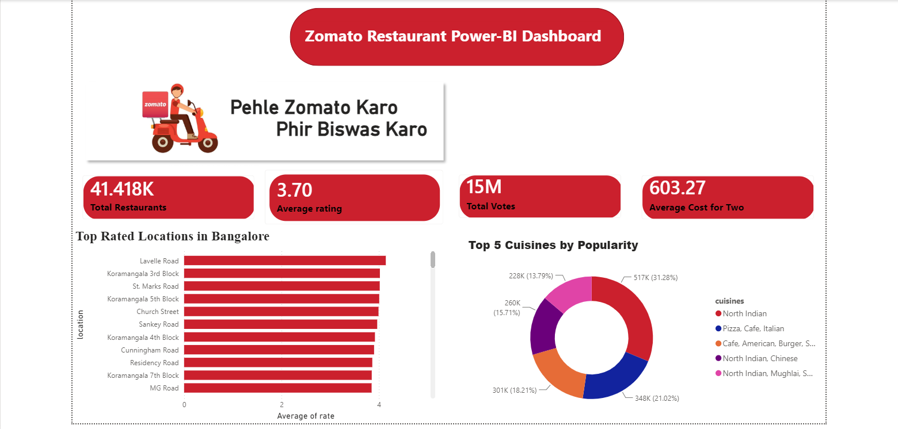
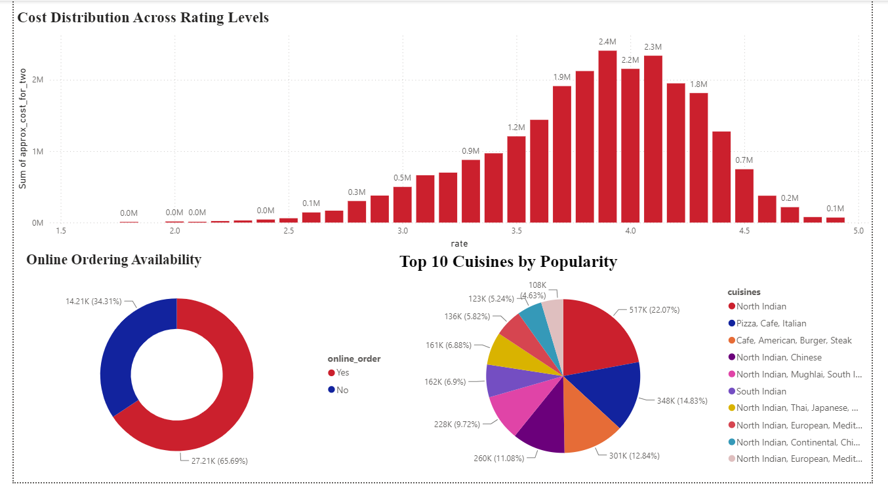
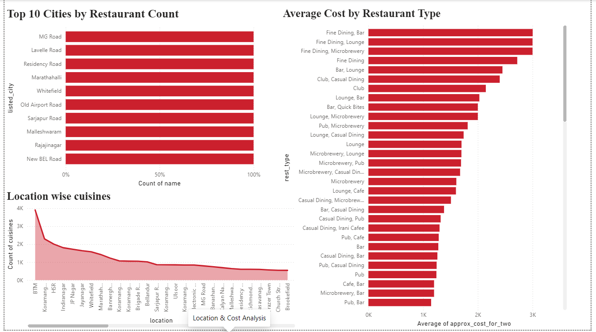

# Zomato Restaurant Analysis - Power BI Dashboard

## 📊 Overview
This project analyzes Zomato restaurant data for Bangalore to uncover insights around restaurant distribution, cuisines, pricing, and customer ratings. The workflow covers the complete data pipeline — from raw data extraction to an interactive Power BI dashboard, including a machine learning model for deeper analysis.

## 🎯 Objective
- Extract and clean raw restaurant data for analysis
- Store and query structured data using SQL
- Train a machine learning model on the dataset
- Visualize key business insights through an interactive Power BI dashboard

## ⚙️ Project Workflow
1. **Data Extraction** – Raw Zomato dataset sourced from Kaggle
2. **Data Cleaning** – Performed using Python (handling missing values, duplicates, formatting inconsistencies)
3. **Data Storage** – Cleaned data loaded into SQL for structured querying
4. **Machine Learning** – Trained a model on the processed dataset for predictive/analytical insights
5. **Visualization** – Built an interactive 3-page Power BI dashboard

## 📁 Dashboard Pages

### 1. Overview
- Total Restaurants: **41.4K**
- Average Rating: **3.70**
- Total Votes: **15M**
- Average Cost for Two: **₹603.27**
- Top rated locations in Bangalore (Lavelle Road, Koramangala, St. Marks Road, etc.)
- Top 5 cuisines by popularity (North Indian leads at ~31%)

### 2. Restaurant & Cuisine Analysis
- Cost distribution across rating levels (restaurants rated 3.5–4.2 dominate spending share)
- Online ordering availability split (~66% restaurants accept online orders)
- Top 10 cuisines by popularity, led by North Indian, Pizza/Cafe/Italian, and Cafe/American/Burger combos

### 3. Location & Cost Analysis
- Top 10 cities/localities by restaurant count (MG Road, Lavelle Road, Residency Road, Marathahalli, etc.)
- Average cost by restaurant type (Fine Dining + Bar/Lounge/Microbrewery combos are the priciest)
- Location-wise cuisine count distribution (BTM leads with ~4K cuisines listed)

## 🛠️ Tools & Tech Stack
- **Python** – Data cleaning & preprocessing (Pandas, NumPy)
- **SQL** – Data storage and querying
- **Machine Learning** – Model training for predictive insights
- **Power BI** – Dashboard design, DAX measures, Power Query

## 📸 Screenshots

### Overview Page

### Restaurant & Cuisine Analysis

### Location & Cost Analysis

## 🔑 Key Insights
- North Indian is the most popular cuisine, accounting for ~31% of total votes
- Around 66% of restaurants offer online ordering
- Fine Dining establishments combined with bars/lounges/microbreweries have the highest average cost for two
- MG Road, Lavelle Road, and Residency Road are among the top localities by restaurant count in Bangalore

## 📌 How to Use
- Clone/download this repository
- Open the `.pbix` file in Power BI Desktop to explore the dashboard
- (Optional) Refer to the Python scripts and SQL queries in this repo for the data pipeline
